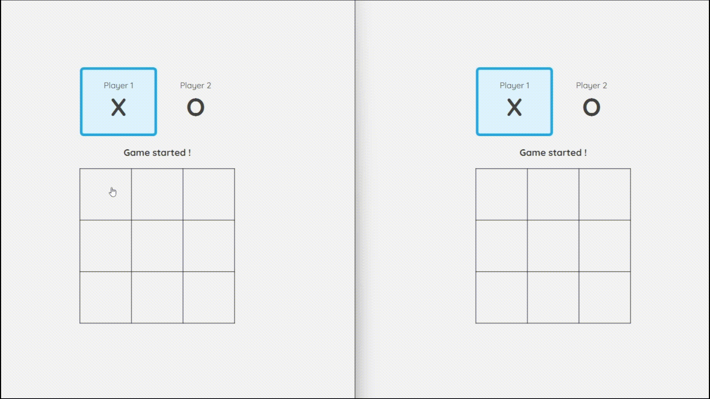
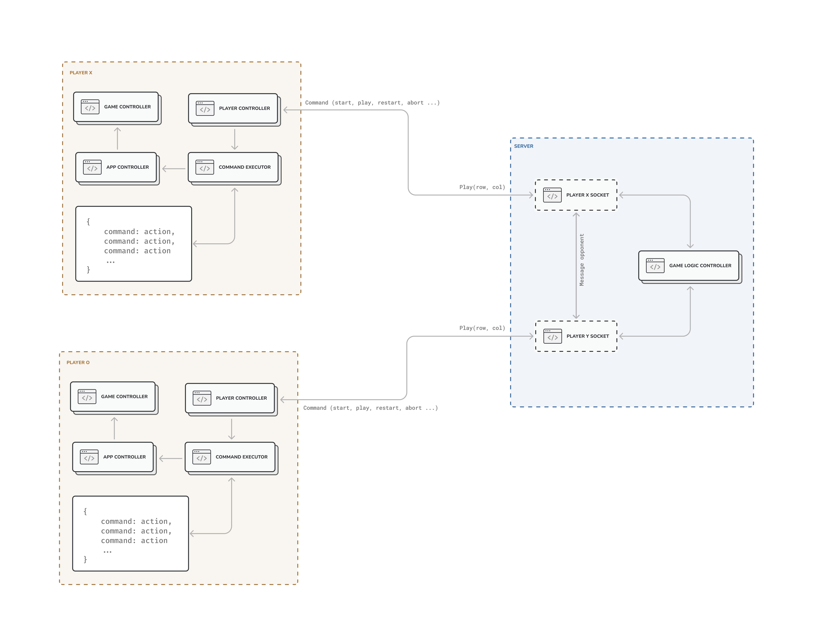

# Multiplayer Tic Tac Toe

This project is a multiplayer Tic Tac Toe game implemented in Java using JavaFX for the graphical user interface and Java Sockets for networking functionality:

- **Multiplayer Gameplay**: Allows two players to compete against each other over a network connection.
- **JavaFX GUI**: Provides an intuitive graphical user interface for a seamless gaming experience.
- **Networking with Java Sockets**: Utilizes Java Sockets to handle communication between the game server and clients.

## Getting started

1. Clone and open the project in your IDE of choice.
2. Run the `server` project to start the game server.
3. Run the `application` project to start the game client (Player X). 
4. Run the `application` project again to start a second client (Player O).
5. Once both players' clients are connected, the game will start automatically. Players will take turns placing X or O marks on the Tic Tac Toe grid.
6. The game follows the standard Tic Tac Toe rules. The first player to successfully place three marks in a row, column, or diagonal wins the game.

## Screenshots

  

## Built with

  

The client is a JavaFX application that communicates with the server over a TCP connection. The server is a Java application that handles communication between the clients and the game logic.

The client is structured with the following essential components:

- **Player Controller**: Manages the communication with the server and interprets incoming commands.
- **Commands Executor**: Executes commands received from server using the command design pattern.
- **App Controller**: Handles the application lifecycle, UI events and game board updates.
- **Game Controller**: Manages the game's fundamental logic, including the handling of player turns and game flow.

The server is structured with the following essential components:

- **Player Socket**: Manages the communication with the client and interprets incoming commands.
- **Game Logic Controller**: Controls the game flow, including player turns, move validation, and determining the game's winner.

## Todo

- [x] Develop the game UI, including the grid and interactive elements.
- [x] Implement game logic for placing X/O marks and determining win/lose conditions.
- [x] Set up the server with networking capabilities for player communication.
- [x] Transfer game logic to the server for synchronization between clients.
- [x] Implement parsing and execution of client commands for game progression.
- [x] Enable automatic game restart after each completed match.
- [ ] Develop the restart game logic, allowing players to initiate a new game round seamlessly.
- [ ] Implement the capability for players to create and join playing rooms.
